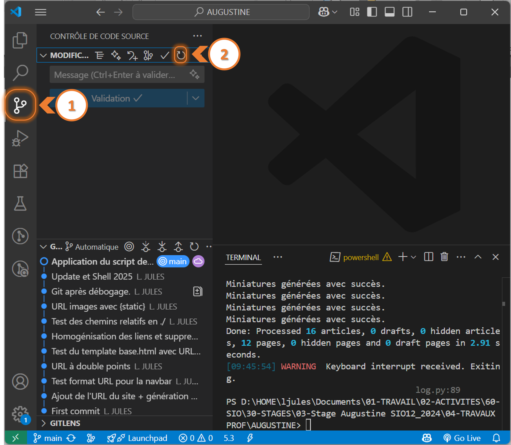
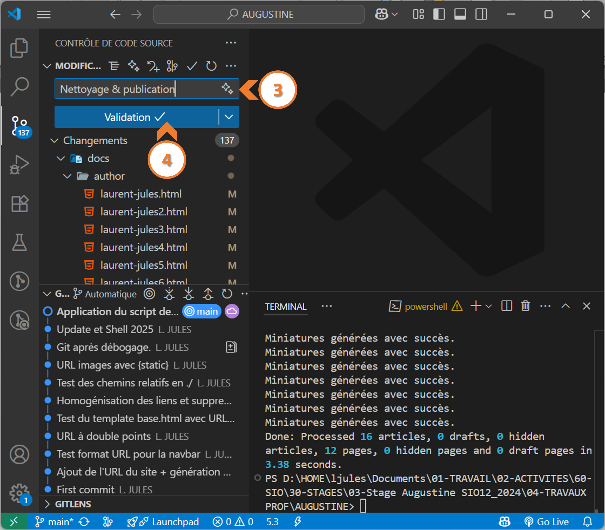
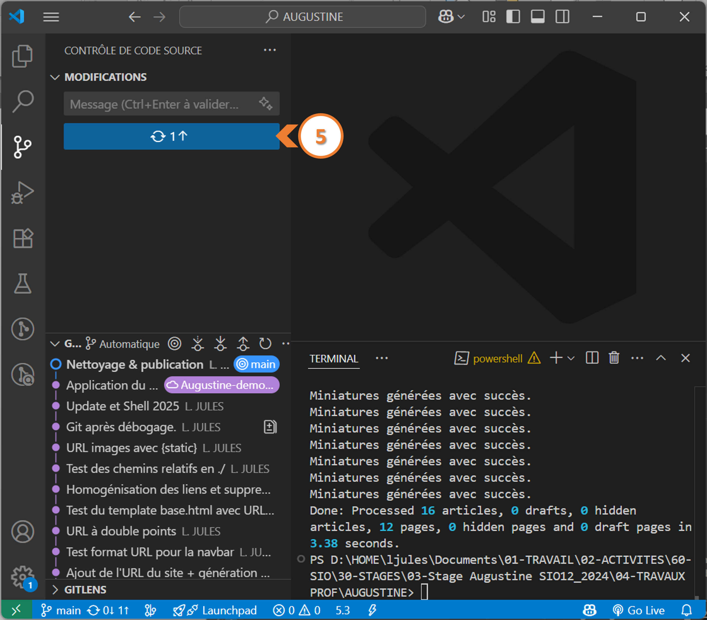

# Mise en situation

Votre site est opérationnel en local, c'est-à-dire que tout fonctionne bien lorsque vous générez et naviguez sur votre site en exécutant la commande `pelican -lr`.

L'étape suivante est d'uploader le contenu du dossier `output` (dossier de la configuration par défaut de **Pelican**) sur votre serveur Web.

> :warning: **Cas particulier de GitHub Pages :**
> Si vous utilisez **GitHub Pages** vous devrez selon votre configuration de ce dernier configurer **Pelican** pour qu'il utilise le dossier `docs` au lieu de `output` pour accueillir les fichiers de production.


# Renseigner le fichier `publishconf.py`

Le fichier `publishconf.py` contient la configuration à appliquer pour générer les fichiers dans le cadre d'une future mise en production sur le serveur Web.

On utilisera ce fichier principalement pour :

- Utiliser des URL absolues au lieu des URL relatives
- Renseigner l'adresse du serveur Web

<div style="page-break-after: always;"></div>

## Exemple de fichier `publishconf.py` pour la publication sur GitHub Pages :

**<u>Contenu du fichier `publishconf.py` :</u>**

``` Python
# This file is only used if you use `make publish` or
# explicitly specify it as your config file.

import os
import sys
sys.path.append(os.curdir)
from pelicanconf import *

# If your site is available via HTTPS, make sure SITEURL begins with https://
SITEURL = 'https://ljules.github.io/Augustine-demo'
RELATIVE_URLS = False

#FEED_ALL_ATOM = 'feeds/all.atom.xml'
#CATEGORY_FEED_ATOM = 'feeds/{slug}.atom.xml'

DELETE_OUTPUT_DIRECTORY = True

# Following items are often useful when publishing

#DISQUS_SITENAME = ""
#GOOGLE_ANALYTICS = ""
```

Il faudra donc veiller à bien renseigner la variable **`SITEURL`** par l'URL de votre serveur. Dans l'exemple ce serveur correspond à celui d'un **GitHub Pages** : `https://ljules.github.io/Augustine-demo`.

<div style="page-break-after: always;"></div>

# Marche à suivre 

## Etape 1 : Génération des fichiers de production :

Par défaut les commandes `pelican -lr` ou `pelican content` utilisent uniquement le fichier `pelicanconf.py` pour générer les fichiers. Donc avant d'uploader les fichiers de production sur le serveur, il faut absolument les générer avec la configuration du  fichier `publishconf.py` en exécutant la commande suivante :

``` Python
pelican content -s publishconf.py
```

# Etape 2 : Upload des fichiers sur le serveur

Généralement on utilisera **Git** et **GitHub** pour réaliser cette tâche afin de réaliser un **commit** et un **push**.

Voici la démarche à suivre avec l'utilisation de **GitHub** avec l'interface graphique de **Visual Studio Code** :

<div style="page-break-after: always;"></div>

**<u>Consignation des fichiers modifiés, créés ou supprimés (`git add`) </u>:**



<div style="page-break-after: always;"></div>

**<u>Commit des fichiers (`git commit`) </u>:**



<div style="page-break-after: always;"></div>

**<u>Synchronisation de GitHub (`git push`) </u>:**

