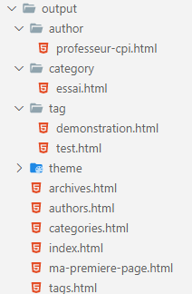

# Installation de l'environnement de développement :

## Installation de **Visual Studio Code** :

Nous utiliserons **Visual Studio Code** pour éditer notre code.

Téléchargement de **VS Code** : [Page téléchargement VS Code](https://code.visualstudio.com/Download) 

Extensions conseillées :
- Aucunes extension particulière

## Installation de **Pelican** :

### Installation avec un environnement virtuel :

Nous allons installer **Pelican** dans un environnement virtuel dans notre exemple.

1. **Création & activation de l'environnement virtuel :**

    1.1. Se placer dans le dossier de travail du projet
    1.2. Exécuter la commande de création d'un environnement virtuel :
    - **`python -m venv env`**

    1.3. Activer l'environnement virtuel avec la commande :
    - **`.\env\Scripts\activate `**


2. **Installation de Pelican et de Markdown** :

    2.1. Une fois l'environnement activé, exécuter la commande d'installation des paquets de **Pelican** et **Markdown**, ains que de leurs dépendances :
    - **`pip install pelican Markdown`**

Nous pouvons vérifier la bonne installation des paquets et de leurs dépendances avec la commande **`pip freeze`** qui nous donne :

```PowerShell
blinker==1.6.2
docutils==0.20.1
feedgenerator==2.1.0
Jinja2==3.1.2
Markdown==3.4.3
markdown-it-py==2.2.0
MarkupSafe==2.1.2
mdurl==0.1.2
Pygments==2.15.1
python-dateutil==2.8.2
pytz==2023.3
rich==13.3.5
six==1.16.0
Unidecode==1.3.6
```
**REMARQUE :** POUR L'INSTANT PELICAN NE FONCTIONNE PAS AVEC L'ENVIRONNEMENT VIRTUEL VENV CAR L'INSTALLATION DES SCRIPTS NE SE FAIT PAS DANS LE DOSSIER .\env\Scripts OU DEVRAIT SE TROUVER NOTAMENT LE FICHIER **pelican-quickstart.exe**. Avec une installation sur le sytème les scripts sont écrits dans le dossier de l'utilisateur : C:\Users\idUser\AppData\Roaming\Python\Python3XX\Scripts

## Installation dans le système :

Il faudra impérativement réaliser l'installation avec un compte **adminsitrateur** sous **Windows**. Dans le cas contraire, les fichiers exécutables comme **pelican-quickstart.exe** seront installés dans le dossier local de l'utilisateur exécutant **PIP** (*C:\Users\idUser\AppData\Roaming\Python\Python3XX\Scripts*).

Exécuter dans un terminal avec les droits d'adminstration la commande : **`pip install pelican Markdown`**


# Création d'un projet **Pelican**

Exécuter la commande : **`pelican-quickstart`**

Une série de questions est posées avec des choix par défaut :


```
Welcome to pelican-quickstart v4.8.0.

This script will help you create a new Pelican-based website.

Please answer the following questions so this script can generate the files
needed by Pelican.


> Where do you want to create your new web site? [.]
> What will be the title of this web site? AugustineTeam 
> Who will be the author of this web site? Equipe CPI
> What will be the default language of this web site? [fr]
> Do you want to specify a URL prefix? e.g., https://example.com   (Y/n) n
> Do you want to enable article pagination? (Y/n)
> How many articles per page do you want? [10]
> What is your time zone? [Europe/Rome] Europe/Paris
> Do you want to generate a tasks.py/Makefile to automate generation and publishing? (Y/n)
> Do you want to upload your website using FTP? (y/N)
> Do you want to upload your website using SSH? (y/N)
> Do you want to upload your website using Dropbox? (y/N)
> Do you want to upload your website using S3? (y/N)
> Do you want to upload your website using Rackspace Cloud Files? (y/N)
> Do you want to upload your website using GitHub Pages? (y/N)
Done. Your new project is available at ...
````

Nous obtenons alors la structure suivante :
```.
├── content
├── output
├── Makefile
├── pelicanconf.py
├── publishconf.py
└── task.py
```
Les dossiers ont pour finalité :
- **`content`** : Contiendra les fichiers souce de notre site.
- **`output`** : Contiendra les fichiers composants notre site et qui seront mis en ligne.


# Création & visualisation d'une page test

## Création d'une page test :

Les fichiers source des pages seront à placer dans le dossier **`.\content\`**. Nous utiliserons dans ce guide le format **Markdown** pour réaliser le contenu des pages du site. L'extension des fichiers sera donc **`.md`.**

**Exemple :**

Créér dans le dossier **`.\content\`** le fichier : **`ma-page-test.md`** et placer le contenu suivant :

```
Title: Ma première page
Date: 2023-05-30 18:00
Tags: Test, démonstration
Category: Essai
Authors: professeur CPI
Summary: Une 1ère page

Voici la 1ère ligne de ma page.

# Le 1er titre de 1er niveau (H1) :

## Le titre de 2e niveau (H2) :

Cette page est une simple démonstation.
Qui contient **quelques éléments**


Une liste **non énumérée** :

- Ligne 1
- Ligne 2


Une liste **énumérée** :

1. En 1er
2. En 2e


Un tableau :

| Syntax | Description |
| ----------- | ----------- |
| Header | Title |
| Paragraph | Text |
```

### Génération du contenu avec **Pelican** :

Pour générer le contenu il suffit d'exécuter la commande **`pelican content`** ou **`pelican`**.

Si tout se passe bien, le terminal doit afficher :

```
Done: Processed 1 article, 0 drafts, 0 hidden articles, 0 pages, 0 hidden pages and 0 draft pages in 0.28 seconds.
```
On pourra voir que du contenu a été produit dans le dossier **`output`** :




### Analyse du dossier `output` :

Le dossier **`output`** comoporte entre autres les dossiers suivants :

- **`author`** : Regroupe tous les articles/pages d'un même auteur, le  regroupement est réalisé par analyse des valeurs de la métadonnée **`author`**.
- **`category`** : Regroupe tous les articles/pages ayant la même catégorie, le regroupement s'appuie sur la valeur de la métadonnée **`category`**.
- **`tag`** : Regroupe tous les articles/pages ayant la même **étiquette/tag**. Le regroupement s'appuie sur la valeur de la métadonnée ***`tag`**.


### Visualisation du rendu :

**Pelican** dispose d'un serveur *Web** permettant de visualiser le rendu de notre site dans un navigateur.
Pour visuliser lancer le serveur de **Pelican** il suffit de taper la commande suivante :

> Commande pour le lancement du serveur :
>
>**`pelican --listen`** ou **`pelican -l`**

Pour visualiser le rendu, il faut lancer un navigateur et saisir l'URL suivante : **`http://localhost:8000`**

**Exemple :**

- Après avoir créé le fichier : **`ma-page-test.md`**
- Et exécuter la commande : **`pelican content`**
- Nous pouvons exécuter la commande de lancement du serveur : **`pelican -l`**

Le terminal affiche normalement l'exécution du serveur Web :

```
Serving site at: http://127.0.0.1:8000 - Tap CTRL-C to stop
```

Vous pouvez constater le résultat dans un navigateur avec l'adresse : **`http://localhost:8000`**


Pour stopper le serveur il suffit d'appuyer sur les touches : **[CTRL] + [C]**

# Arborescence du projet :

Il est conseillé de de placer les différentes catégories/rubriques dans un sous-dossier qui portera le nom de la catégorie. Par défaut c'est la valeur associée à la clé `category` des métadonnées de la page qui définit la rubrique/catégorie. Le paramètre  


# Les métadonnées

Chaque fichier de page peut contenir des métadonnées. Voici l'ensemble des métadonnées disponibles selon la documentation officielle de **Pelican**.

|   **METADATA**   |                        **DESCRIPTION**                                                          |
| ---------------- | ----------------------------------------------------------------------------------------------- |
| `title`          | Titre de l'article de la page (**OBLIGATOIRE**)                                                 |
| `date`           | Date de publication (ex : *YYYY-MM-DD HH:SS*) (**OBLIGATOIRE**)                                 |
| `modified`       | Date de modification (ex : *YYYY-MM-DD HH:SS*)                                                  |
| `tags`           | Etiquettes (séparés par des virgules), permet d'accéder aux article par étiquettes              |
| `keywords`       | Mot clés (séparés par des virgules)                                                             |
| `category`       | Catérogie/rubrique (**UNE SEULE**), permet regrouprer les article par catégorie                 |
| `slug`           | Identifiant utilisé pour construire l'URL de l'article, sinon l'URL est construire avec `title` |
| `author`         | Auteur unique (si un seul auteur), on pourra accédere à tous les articles d'un auteur           |
| `authors`        | Les auteurs (si plusieurs)                                                                      |
| `summary`        | Résumé bref de l'article, si non renseigné, ça sera le début de l'article qui sera extrait      |
| `lang`           | Identifiant de la langue (en, fr, etc.)                                                         |
| `translation`    | Booléen indiquant une traduction (`true` ou `false`)                                            |
| `status`         | Statu de l'état : `draft`, `hidden` ou `publié`                                                 |
| `template`       | Nom du template à utiliser pour générer la page (sans extension)                                |
| `save_as`        | Chemin relatif pour sauvegarder                                                                 |
| `url`            | URL pour la page/article                                                                        |


## Exemple :

```
title: Accueil
date: 2023-06-11 07:30
```

# Les options du fichier de configuration :

Le fichier de configuration `pelicanconf.py` contient une partie des options disponible, notament celles que nous avons renseigné au moment de la génération du projet avec la commande `pelican-quickstart`.

**Voici une description des principales options :**

> `DEFAULT_CATEGORY = 'misc'`
>
> Catégorie accueillant des articles/pages dont la métadonnée `category` n'est pas renseigné et que l'option `USE_FOLDER_AS_CATEGORY` est à **false**


> `DISPLAY_PAGES_ON_MENU` = True
>
> Selon que le template le permet.

> `DISPLAY_CATEGORIES_ON_MENU` = True
>
> Afficher ou pas les catégories dans le menu.

> `DELETE_OUTPUT_DIRECTORY` = False
>
> Effacer le contenu du dossier `output` avant de générer le contenu du site.

> `OUTPUT_RETENTION` = []
>
> Liste de fichiers qui ne doivent pas être effacés dans le dossier `output`.

> `OUTPUT_PATH` = 'output/'
>
> Nom du dossier accueillant les fichiers générés.

> `STATIC_CHECK_IF_MODIFIED` = False
>
> 

> `PORT` = 8000
>
> Numéro de port utilisé pour le serveur de **Pelican**.


# Gestion des éléments statiques - Les images :

Nos pages vont contenir des éléments qui seront fournis et statiques, typiquement les images qui seront incluses dans nos différentes pages. Nous avons donc besoin :
1. D'un dossier pour accueillir nos images;
2. De configurer **Pelican** pour qu'il recopie l'ensemble des images dans le dossier **`output`** pour qu'elles soient accessibles en production.

Pour les images, nous les placerons dans un dossier **`images`** qui sera placé dans le dossier **`content`**.

Pour la configuration, nous allons ajouter l'instruction suivante au fichier **`pelicancconf.py`** :
- **`STATIC_PATHS = ['images']`**


# Travail avec des URL relative durant la phase de développement

Le fichier de configuration `pelicanconf.py` il y a une option qui permet de travailler des URL relatives. Cette option est par défaut désactivée (présence d'un **#** en début de ligne).
Pour l'activer, il suffit de supprimer le **#**.

> Le fichier de configuration `pelicanconf.py` comporte l'option suivante :
>
> `# Uncomment following line if you want document-relative URLs when developing`
>
> `# RELATIVE_URLS = True`

Si l'option est activée, tout les chemins seront relatifs et commencerons par `./`, dans le cas contraire, les URL commencerons par un simple `/` si la constante **`SITEURL`** n'est pas renseigné ou par sa valeur elle en comporte une.

>**NOTE :** Il y a un bug actuellement dans la construction des liens des images pour les "rubriques". L'image sera correctement affichée dans sa page, par contre la page générée dans la section rubrique comporte un lien erroné sur les images car lien ne sera pas mis à jour pour commencer par **`../`** au lieu de **`./`**. En effet les rubriques sont stockées dans des dossiers portant le nom de la rubrique, il faut donc remonter au dossier parent pour atteindre le dossier **`images`**.
>
>Par contre il n'y aura pas d'erreur si le fichier markdown de la page a été placé dans un sous-dossier.


# A propos du serveur de développement

La commande `pelican -l` permet d'exécuter le serveur de développement intégré à **Pelican**. Cependant avec cette commande les mises à jour du site ne sont pas répercutées automatiquement. Il faut arrêter le serveur et relancer la commande `pelican`.

Il est possible d'éxecuter le serveur en mode *autoreload* afin que la commande `pelican` se lance automatiquement en cas de modification des fichiers du site.

> **Démarrage du serveur en mode reload  :**
>
> - **`pelican -lr`**  

Précision du port :
- Dans le fichier de configuration `pelicanconf.py` utiliser la constante **`PORT`** pour spécifier un numéro de port (8000 par défaut).


# Les thèmes & templates

Les thèmes permettent de configurer le style du rendu de notre site. Par défaut **Pelican** est installé avec 2 thèmes :
- *notmyidea*
- *simple*

> **Lister les thèmes installés :**
>
> Il est possible de lister les thèmes installer avec la commande suivante :
>
> **`pelican-themes -l`**

## Changer de thème

Le choix du thème se fait naturellement dans le fichier de configuration de **Pelican**. L'option est identifiée par la constante **`THEME`**. Pour attribuer le thème *simple* par exemple, il suffit d'inscrire la ligne suivante dans le fichier `pelicanconf.py` : **`THEME = 'simple'`**


## Trouver & installer de nouveaux thèmes :

Deux thèmes c'est un peu pauvre surtout que le thème *simple* est plus que minimaliste.

Heureuseument nous pouvons ajouter et personnaliser les thèmes.

Pour des thèmes ont été développé par une communauté, nous pouvons les retrouver sur un dépôt **GitHub** : 
- https://github.com/getpelican/pelican-themes

Pour installer un thème il faut ouvrir un terminal avec les droits d'administrateur et saisir la commande :

```
pelican-themes --install "d:\chemin\dossier\du\theme\nom-du-theme"
```

## Utiliser un thème personnalisé

Par défaut le thème sera recherché dans le dossier des bibliothèques de **Python**. Généralement le chemin sous **Windows** est le suivant :
- `C:\Program Files\Python3XX\Lib\site-packages\pelican\themes`

Si vous désirez créer ou modifier un thème existant, il vaudra mieux alors recopier le dossier du thème original dans le dossier du projet.

**Exemple :** `THEMES/notmyidea_perso``

On pourra alors renseigner le thème dans le fichier de configuration du projet (`pelicanconf.py`) :
- **`THEMES/notmyidea_perso`**


## Composition des fichiers & dossier d'un thème

Un thème est structuré par :
- Des éléments de style constenu dans le dossier **`static`**:
    - Fichier(s) **CSS**
    - Fichiers *assets*, c'est-à-dire les fichiers qui seront utilisés pour générer tout ou partie de votre site. On y trouve plus particulièrement les images (fonds, icônes, polices, etc.).

- Des fichiers de templates contenu dans le dossier **`templates`**, qui sont des fichiers **HTML**. Certains fichier de template utilise un mécanisme d'import d'autre(s) fichier(s) template(s). 

```
├── static
│   ├── css
│   └── images
└── templates
    ├── archives.html         // to display archives
    ├── period_archives.html  // to display time-period archives
    ├── article.html          // processed for each article
    ├── author.html           // processed for each author
    ├── authors.html          // must list all the authors
    ├── categories.html       // must list all the categories
    ├── category.html         // processed for each category
    ├── index.html            // the index (list all the articles)
    ├── page.html             // processed for each page
    ├── tag.html              // processed for each tag
    └── tags.html             // must list all the tags. Can be a tag cloud.
```


### Principe générale du génération du site par Pelican

Les actions globales de Pelican :
- Pour chaque fichier "article" rencontré, **Pelican** lui généré une page au format **HTML**.
- Pour le site en général, **Pelican** élabore les pages :
    - **`index.html`** :

