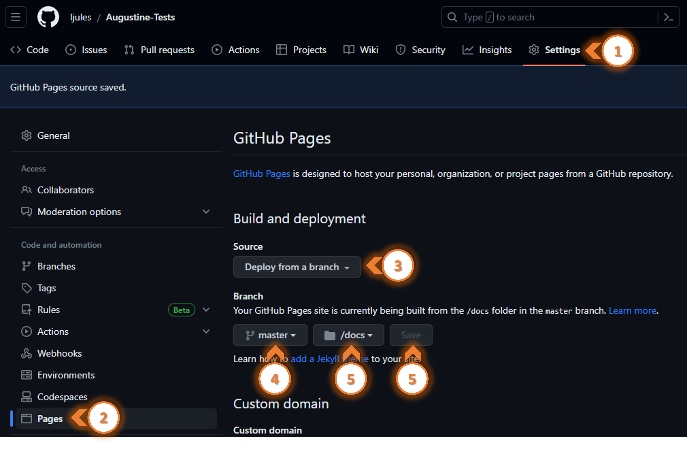

# Sources :

- Documentation officielle en français : [documentation GitHub Pages](https://docs.github.com/fr/pages/getting-started-with-github-pages/about-github-pages)

# Objectifs & principes :

## La fonctionnalité GitHub Pages :
**GitHub** propose un service d'hébergement de sites statiques désigné **GitHub Pages**. Le site est alors accessible via le domaine : `github.io`, mais il est également possible d'utiliser un domaine personnalisé.

Historiquement **Jekyll** était le générateur de site site statique (**GSS**) supporté par **GitHub**. Mais actuellement il est possible d'utiliser d'autres solutions de générateurs de sites statiques ou de déposer directement les fichiers statiques de notre site (`.html`; `.css`; ...).

Par défaut le site est généré par **Jekyll**, il faudra le désactiver en cas d'utilisation d'une autre solution comme un générateur de site de site statique (**GSS**) en déposant dans un fichier vide ayant le nom : **`.nojekyll`**

Attention, le serveurservice **GitHub Pages** ne propose pas la prise pas en charge des langages comme **PHP**; **Ruby** ou **Python** côté server.

## Les 3 types de sites GitHub Pages :
Il existe 3 types de sites :
- projet
- utilisateur
- organisation

Les sites de type **projet** sont liée à un projet hébergé sur **GitHub**. Les sites **utilisateur** ou **organisation** sont liés à un compte **GitHub**.

### Nom de domaine selon le type de sites :

#### Site utilisateur :
Dans le cas d'un site **utilisateur** l'**URL** sera de la forme :
- **`https://<username>.github.io`**.

##### Site d'organisation :
Dans le cas d'un site  d'**organisation** l'**URL** sera de la forme :
- **`https://<organisation>.github.io`**

#### Site de projet :
Dans le cas d'un projet, l'**URL** sera de la forme selon que le projet est associé à un compte **utilisateur** ou d'**organisation** :
- **`https://<username>.github.io/<nomDepot>`**
- **`https://<organisation>.github.io/<nomDepot>`**

>**RETOUR D'EXPERIENCE :** 
>L'utilisation d'un site de projet pose un problème dans la résolution d'URL pour les ressources internes comme les images.
>Le problème se pose pour la résolution des liens relatifs. Imaginons que toutes les images soit stockées dans un dossier `images`. On renseigne les liens de nos photos selon ce schéma : `` 
>La résolution de l'URL va produire la référence suivante : `https://<username>.github.io/images/monImage.jpg"` L'URL est fausse car elle ne contient pas le nom du dépôt car le lien opérationnel serait : `https://<username>.github.io/<nomDepot>/images/monImage.jpg"`

# Mécanisme de publication :
La publication du site sera enclenchée par :
- La poussée des fichiers vers une branche spécifique.
- L'exécution d'un `workflow GitHub Actions` écrit spécfiquement pour publier le site.

Si nous désirons pas contrôler le processus de génération, nous pouvons publier les modifications vers une branche spécifique. Il nous restera à configurer/spécifier la branche désirée, sachant que n'importe qu'elle branche est éligible. Le dossier source peut-être la racine du dépôt ou un dossier `/docs`.

# Limites d'utilisation :
- L'ensemble des fichiers publiés ne doivent pas excéder 1 Go.
- Un déploiements *GitHub Pages* sera annulé s'il prend plus de 10 minutes.
- La bande passante du site est plafonnée à 100 Go par mois.

# Configuration de GitHub Pages :

## Configuration de GitHub-Pages pour un dépôt :

