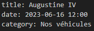

# Rédaction d'un article
## Nouvel article
Pour commencer, créer un fichier avec l'extension **.md** dans le dossier ayant le nom de la **catégorie** où vous souhaitez placer l'article.

Ensuite, il y a quelques paramètres obligatoires à entrer avant d'écrire quoi que ce soit:
 - `title:` *Nom de l'article* 
 - `date:` Date de l'écriture de l'article sous le format *AAAA-MM-JJ HH:MM*
 - `category:` Nom de la catégorie, dans le cas présent le nom du dossier

 Une fois cela fait, le résultat devrait ressembler à cela :
 
 


 ## Rédaction de l'article
 Une fois les premières étapes accomplies, il est alors possible de rédiger l'article. Le format des fichiers est le format **MarkDown**.

### Régles syntaxique du MarkDown

 Voici quelques règles importantes pour rédiger un texte en **MarkDown** :


#### La mise en titre

La réalisation des titre est très simple, il suffit de commencer par nombre n de caractères *`#`* suivi d'un espace. Si n = 1 c'est un titre de niveau 1; n = 2 c'est un titre de niveau 2, etc.

**<u>Exemple :</u>**

_Code Markdown :_
``` md
### Titre de niveau 3
#### Titre de niveau 4
##### Titre de niveau 5
```

_Rendu :_
> ### Titre de niveau 3
> #### Titre de niveau 4
> ##### Titre de niveau 5


### Insertion d'une image

 Pour insérer une image il suffit d'ouvrir la balise `img` puis renseigner le chemin relatif vers l'image exemple:
 ``


### Mise en italique

  Pour mettre le texte en italique il faut le mettre entre une paire **`*...*`** ou entre une paire de **`_..._`**

 **<u>Exemple :</u>**

_Code Mardkown :_ 
``` md
   *Ce texte est en italique*

   _Ce texte est aussi en italique_
```

_Rendu_ :
 > *Ce texte est en italique* 

 >  _Ce texte est aussi en italique_


### Mise en gras 

 Pour mettre le texte en gras il faut le placer entre une paire de double **`*`**, soit **`**...**`**


**<u>Exemple :</u>**

_Code Markdown :_
 ``` md
 **ce texte est en gras**
 ```

 _Rendu :_
 > **ce texte est en gras**


### Texte souligné

Le **Markdown** ne prend pas en charge nativement le soulignement de mots/textes. On contournera cette limite en utilisant du code _HTML_ comme la balise **`<u>...</u>`**


**<u>Exemple :</u>**

_Code Markdown :_
``` md
Voici un mot <u>important</u> et souligné.
```

_Rendu :_
> Voici un mot <u>important</u> et souligné.

### Exposant et indice

Markdown dispose 2 syntaxes pour indiquer qu'une portion de texte devra être placé en exposant ou en indice.

#### Mise en exposant

La mise en exposant utilise une paire de **`^`**.

**<u>Exemple :</u>**

_Code Markdown :_
``` md
1^er^ exemple
2^e^ exemple
```

_Rendu :_
> 1^er^ exemple

> 2^e^ exemple


#### Mise en indice

La mise en indice utilise des paires de **`~`**.

**<u>Exemple :</u>**

_Code Markdown :_
```
- H~2~O : Molécule de l'eau
```

_Rendu_
> H~2~O : Molécule de l'eau

### Texte barré

On utiliser une double paire du caractère **`~`** (**`~~...~~`**) pour barrer une portion de texte.

**<u>Exemple :</u>**

_Code Markdown :_
``` md
Le texte suivant est barré ~~texte barré~~ grâce à la syntaxe dédiée.
```

_Rendu :_
> Le texte suivant est barré ~~texte barré~~ grâce à la syntaxe dédiée.


### Les listes non ordonnées

Il suffira de placer un *`-`* suivi d'un espace en début de chaque ligne.
Il est possible de créer des sous-listes en plaçant des tabulation en début de ligne.

**<u>Exemple :</u>**

_Code Markdown :_
```
- Ligne 1
- Ligne 2
    - Sous-ligne
        - Sous-sous ligne
        - Sous-sous ligne
- Ligne 3
```


_Rendu :_

> - Ligne 1
> - Ligne 2
>     - Sous-ligne
>         - Sous-sous ligne
>         - Sous-sous ligne
> - Ligne 3


### Les listes ordonnées

Principe de base identique aux listes non ordonnées sauf qu'on indiquera directement le numéro suivi d'un point *`.`*.

**Exemple :**

_Code Markdown :_
``` md
1. Niveau 1 - 1ère entrée
2. Niveau 1 - 2e entrée
    1. Sous-niveau
    2. Sous-niveau
3. Niveau 1 - 3e entrée
```

_Rendu :_
> 1. Niveau 1 - 1ère entrée
> 2. Niveau 1 - 2e entrée
>     1. Sous-niveau
>     2. Sous-niveau
> 3. Niveau 1 - 3e entrée


### Les listes de tâches

Il est très facile de réaliser des _todo lists_ avec **Markdown**.

_Code Markdown :_
``` md
- [ ] Faire mes devoirs
- [x] Contacter Paul
- [ ] Trier mes fichiers
```

_Rendu :_
> - [ ] Faire mes devoirs
> - [x] Contacter Paul
> - [ ] Trier mes fichiers


### Lien (URL)

Nous pouvons utiliser la syntaxe **HTML** avec `<a href="mon_lien.org">Mon lien à cliquer</a>`
Ce qui donne : <a href="mon_lien.org">Mon lien à cliquer</a>

Mais on pourra utiliser la syntaxe dédiée de **Markdown** : `[Mon lien à cliquer](mon_lien.org)`, ce qui donne également : [Mon lien à cliquer](mon_lien.org)

Selon le moteur de rendu, il est également possible de rendre directement un lien en saisisant directement l'URL : `http://mon_lien.org` ce qui donne : http://mon_lien.org


#### Rédiger du code informatique sur une ligne 

 Une instruction/ligne de code devra être placée entre deux backtits **`...`** (touches **[ALT GR]** + **[è]**)
 
 Exemple : `print("Coucou")`


 #### Rédiger du code informatique sur plusieurs lignes

Pour présenter du code informatique sur plusieurs lignes ont placera ce code entre une 1ère ligne avec trois backtits et une dernière ligne contenant également trois backtits.

> :bulb: **Astuce :** Il est possible d'appliquer une coloration syntaxique, pour cela il faut indique le langage sur la 1ère ligne après les 3 backtits **```**.

_Code Markdown :_
```
``` python
for i un range 10:
    print(i)
``

```

_Rendu :_
> ``` python
> for i in range 10:
>     print(i)
> ```


### Ligne horizontale :

Il est possible de tracer une ligne horizontale de séparation. Pour ce faire il suffira de placer sur une ligne 3 tirets (`-`) successifs.

``` md
---
```
---


### Les tableaux 

#### Tableaux de base 

Pour réaliser des tableaux, nous allons utiliser des caractères _pipes_ **`|`** pour marquer les colonnes et le tiret haut **`-`** pour séparer la ligne d'entête des autres lignes.

<u>Remarque :</u> Il faut au minimal 3 **`-`** pour marquer l'entête.

_Code Markdown_ :
``` Markdown
| Colonne 1 | Colonne 2 | Colonne 3 |
|-----------|-----------|-----------|
| Texte 1   | Texte 2   | Texte 3   |
| Texte 4   | Texte 5   | Texte 6   |
```

_Rendu :_

> | Colonne 1 | Colonne 2 | Colonne 3 |
> |-----------|-----------|-----------|
> | Texte 1   | Texte 2   | Texte 3   |
> | Texte 4   | Texte 5   | Texte 6   |


#### Contrôle de l'alignement horizontal

L'alignement horizontal du texte peut être spécifié en plaçant le caractère **`:`** :
- **`:---`** : Alignement gauche
- **`---:`** : Alignement droit
- **`:---:`** : Alignement centre


**<u>Exemple :</u>**

_Code Markdown :_
``` md
| Alignement Gauche | Alignement Centre | Alignement Droit |
| :---              | :---:             | ---:             |
| Texte 1           | Texte 2           | Texte 3          |
```


_Rendu :_
> | Alignement Gauche | Alignement Centre | Alignement Droit |
> | :---              | :---:             | ---:             |
> | Texte 1           | Texte 2           | Texte 3          |


**<u>Astuce :</u>**
La rédaction des tableaux est fastidieu, on pourra le créer avec des générateurs de tableau comme :
- <a href="https://www.tablesgenerator.com/markdown_tables">https://www.tablesgenerator.com/markdown_tables</a>
- <a href="https://anywaydata.com/">https://anywaydata.com/</a>


#### Les sauts de page

Il n'existe pas d'instruction Markdown pour faire des sauts de page. On contournera ce manque en utilisant du _HTML/CSS_. Il suffira d'insérer la ligne suivante :

``` HTML
<div style="page-break-after: always;"></div>

```


### Les notes de bas de page

Il est possible de générer des notes de bas de page. Pour cela il faut utiliser un identifiant qui permettra de faire le lien entre la note et son indice/identifiant.

Je place ici[^1] ma première note de base de page. Et là[^bignote] la seconde note.

[^1] : Texte associé à la 1^ère^ note.
[^bignote] : Texte associé à la 2^e^ note.


### Les emojis

Il est existe des raccourcis permettant d'afficher des emojis. Le raccourci est constitué d'une paire de de double points **`:...:`** qui encadrent le nom du raccourci.

**<u>Exemples :</u>**

_Code Markdown :_
``` md
- Ampoule : :bulb:
- Voiture : :car:
- Nuage : :cloud:
```

_Rendu :_
> - Ampoule : :bulb:
> - Voiture : :car:
> - Nuage : :cloud:

### Abdominitions

> :warning: **Warning :** Do not push the big red button.

> :memo: **Note :** Sunrises are beautiful.

> :bulb: **Tip :** Remember to appreciate the little things in life.


 ## Publier l'article sur le site
 Une fois l'article rédigé, ouvrez un invite de commandes, placez vous à la racine du projet (c'est à dire dans le dossier qui contient tous les dossiers et les fichiers concernant le projet) puis faites la commande `pelican` et les articles apparaitront alors sur le site.