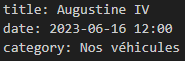

# Rédaction d'un article
## Nouvel article
Pour commencer, créez un fichier avec l'extension ".md" dans le dossier ayant le nom de la catégorie où vous souhaitez placer l'article.

Ensuite il y a quelques paramètres obligatoires à entrer avant d'écrire quoi que ce soit:
 - "title: [nom de l'article]" 
 - "date: [date de l'écriture de l'article sous le format année-mois-jour heure:minutes.]"
 - "category: [nom de la catégorie, dans le cas présent le nom du dossier]"

 une fois cela fait, le résultat devrait ressembler à ça:
 
 

 ## Ecrire l'article
 Une fois les premières étapes accomplies, il reste l'article à écrire. Premièrement, pour écrire du texte, pas besoin de le mettre dans une balise comme en html juste l'écrire directement dans le code suffit et pour retourner à la ligne il suffit dans saut de ligne dans le code *markdown*.

 Voici quelques fonctionnalités importantes à savoir pour rédiger un texte en *markdown* :
 - Pour écrire du texte sans qu'il soit interprêté par *markdown* il faut le mettre entre deux backtits `` ([ALT GR] + [è])
 
 exemple : `**ce texte n'est pas interpreté comme étant en gras**`
 - pour mettre un texte en titre, mettre un à cinq # pour varier la taille suivi du texte

 exemple: 
  ##### ce texte est un titre de niveau 5
 - pour insérer une image il suffit d'ouvrir la balise img puis renseigner le chemin relatif vers l'image exemple:
 ``

  - pour mettre le texte en italique il faut le mettre entre deux * 

  exemple : *ce texte est en italique*
 - pour mettre le texte en gras il faut le mettre entre quatre * 
 
 exemple : **ce texte est en gras**
 - pour faire un taleau il faut mettre écrire entre des les barres (appelées pipe) comme ceci: 

 | colonne 1 | colonne 2 |
 |---------|--|
 | texte 1 | texte2 | 

 Assurez vous d'avoir sauté une ligne avant de faire le tableau sinon le tableau peut ne pas apparaitre dans certains cas, par exemple si vous êtes dans un texte lié à un tiret

 - exemple
 | colonne 1 | colonne 2 |
 |---------|--|
 | texte 1 | texte2 | 

 ## Publier l'article sur le site
 une fois l'article rédigé, ouvrez un invite de commandes, placez vous à la racine du projet (c'est à dire dans le dossier qui contient tout les dossiers et les fichiers concernant le projet) puis faites la commande `pelican` et les articles apparaitront alors sur le site.