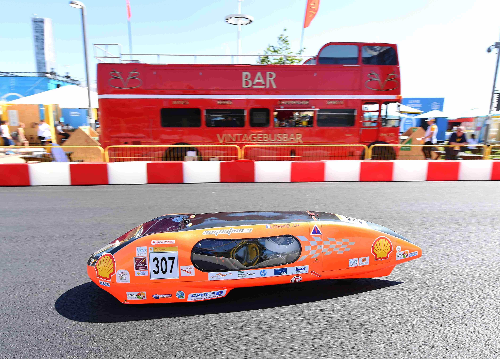

# Bienvenue sur note site !

Bienvenue sur notre site. Vous trouverez ici toutes les informations à propos de notre aventure, véhicules, participations et plus encore.
Nous sommes une équipe de professeurs et d'étudiants qui prennons part chaque année au pretigieux challenge mondial **Shell Eco-Marathon**

## Qui sommes-nous ?

Nous sommes une équipe d'élèves et d'étudiants qui conçoivent un véhicule électrique qui nous permet maintenant depuis 2015 de participer au **Shell Eco-Marathon**.

## Quelle formation et diplômes ?

Nous sommes principalement des enseignants et étudiants de la Section de Technicien Supérieur (S.T.S.) en Conception de Produits Industriels. Mais certains et surtout certaines élèves qui prennent le rôle de pilote peuvent venir des classes de la filière générale et technologique. Ces élèves préparent soit un bac général, soit un bac technologique STI2D.

## Quel établissement ?

Le lycée Léonard de Vinci de Melun.

