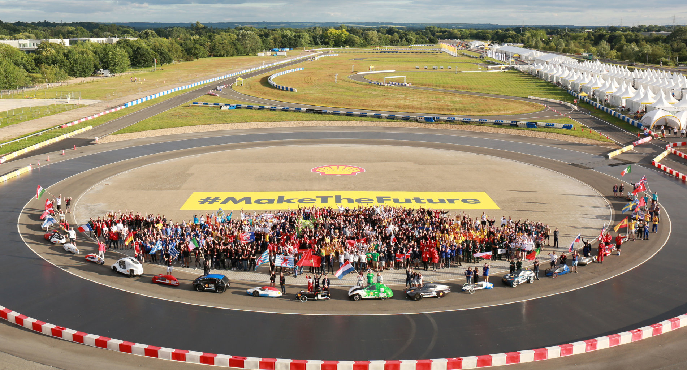
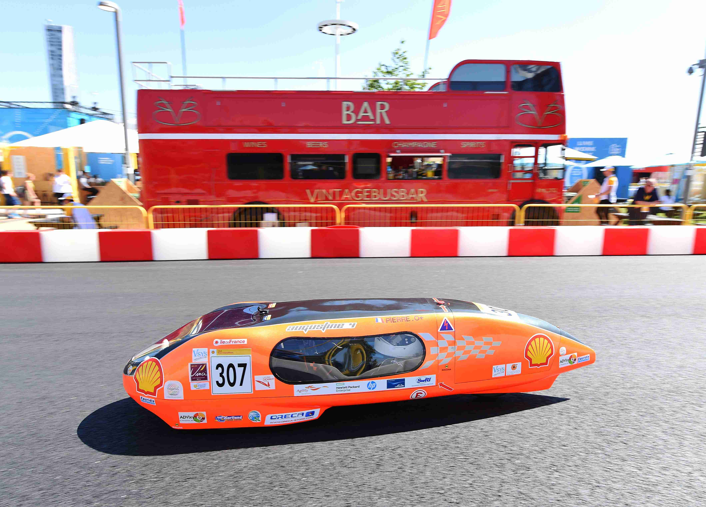
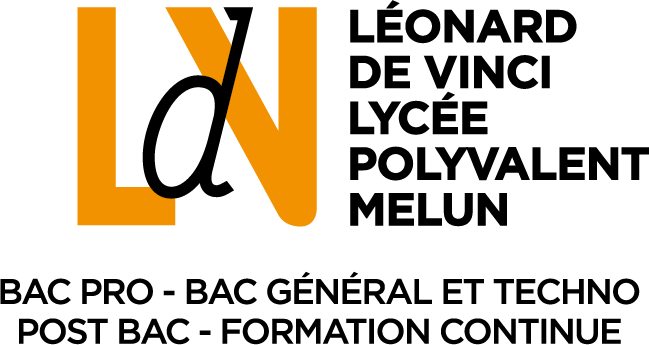

# Bienvenue sur notre site !

Bienvenue sur notre site. Vous trouverez ici toutes les informations concernant notre aventure : véhicules, participations au marathon _Shell_ depuis 2015, et bien plus encore.  
Nous sommes une équipe de professeurs et d’étudiants qui prennent part chaque année au challenge mondial d'éco-mobilité **Shell Eco-Marathon**.

> :bulb: **En savoir plus sur le marathon _Shell_ ?** Consulte notre page dédiée : [A propos du Marathon Shell](pages/a-propos-du-shell)

## Qui sommes-nous ?

Nous sommes une équipe d’élèves et d’étudiants qui ont conçu plusieurs véhicules électriques au nom d’**Augustine**(s). Cela nous permet, depuis 2015, de participer au **Shell Eco-Marathon**.

> :bulb: Consulter les différentes équipes depuis notre 1ère participation en 2015 :
> 
> - [Nos équipes](pages/equipes)

> :bulb: En savoir plus sur nos différents véhicule, consulte notre page dédiée :
> 
> - [Augustine I](pages/augustine-1)
> - [Augustine II](pages/augustine-2)
> - [Augustine III](pages/augustine-3)
> - [Augustine IV](pages/augustine-4)
> - [Augustine V](pages/augustine-5)

## Quelles formations et quels diplômes ?

Nous sommes principalement des enseignants et des étudiants de la **S**ection de **T**echnicien **S**upérieur (**S.T.S.**) en **C**onception de **P**roduits **I**ndustriels. Cependant, certains élèves, et surtout certaines élèves qui endossent le rôle de pilote, peuvent venir des classes de la filière générale ou technologique. Ces élèves préparent soit un baccalauréat général, soit un baccalauréat technologique **STI2D**.

## Quel établissement ?

Le lycée Léonard de Vinci de Melun.

