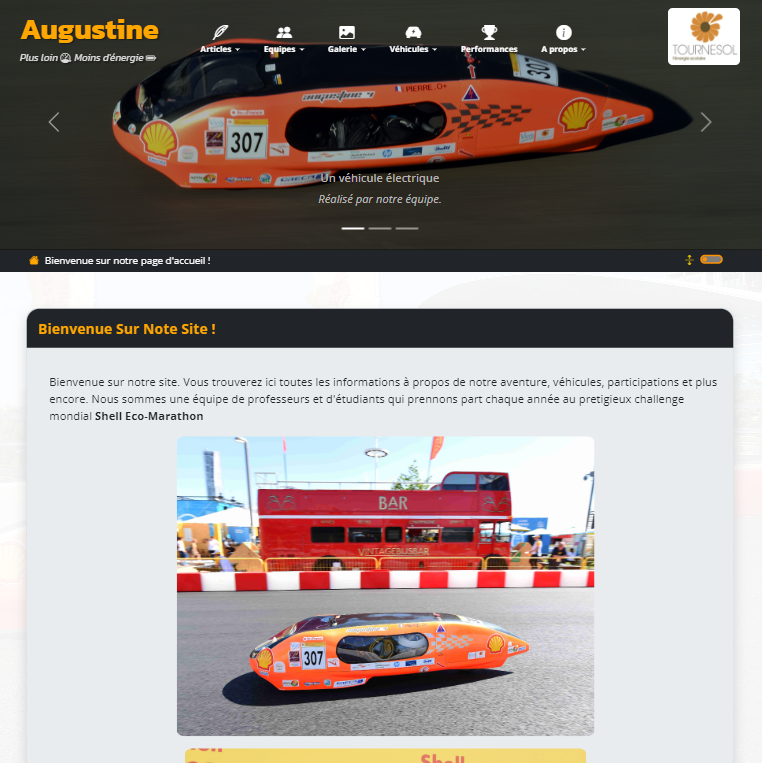

# Site Augustine avec le générateur de site statique **Pelican**

## Aperçu du site :

**Sur PC :**

**Sur mobile :**

## Brève présentation :

**Vous trouverez une documentation plus détaillée dans le dossier :file_folder: `DOCUMENTATION` :**
> - Guide d'installation et de configuration de **Pelican** sous Windows :
>   - `DOCUMENTATION/Guide Pelican avec Windows.md`
> - Guide de rédaction des articles :
>    - `DOCUMENTATION/Guide articles.md`

**Voici un rappel des principales commandes :**
> - **`pelican content`** : Génère l'ensemble des fichiers du projet en utilisant la configuration du fichier `pelicanconf.py`.
> - **`pelican -lr`** : Exécute le serveur local de **Pelican** pour tester le site en local. L'URL est : <a href="http://localhost:8000">http://localhost:8000</a>
> - **`pelican content -s publishconf.py`** : génère l'ensemble des fichiers en vue de la mise en production du site.

## Dépendances :

La construction du site nécessite la bibliothèque **pillow** (génération des vignettes et extraction des données *EXIF* des photos pour la galerie).

## Ajouter du contenu au site :

### Structure & composition du site :

Le site est composé de deux principales entités :

- **Les articles :** Un **article** est caractérisé par son contenu, ainsi que par sa **date**, sa **catégorie**, ses **mots-clés** et son ou ses **auteur(s)**. **Pelican** maintient un classement chronologique des articles et réalise leur recensement par **catégorie**, **auteur** et **mots-clés**.
  
- **Les pages :** Les pages sont des contenus accessibles depuis différents points de navigation du site. Elles sont caractérisées uniquement par leur contenu ; elles ne possèdent pas de date, d’auteur, de catégorie ou de mot-clé. Certaines pages sont rédigées manuellement par les administrateurs du site, tandis que d'autres sont générées automatiquement à partir de fichiers (`md`, `csv`, `jpg`...).

### La page d'accueil :

La page d'accueil est composée de deux parties :
- Le contenu d’accueil
- La liste chronologique de l'ensemble des articles

### Modifier le contenu de la page d'accueil :

Le contenu d’accueil est placé dans le fichier : `content/accueil.md`.

### Ajouter des articles :

Tous les articles du site sont à rédiger au format **Markdown** et doivent être placés dans le dossier : **`content/articles`**. Ce dossier peut contenir des sous-dossiers afin de faciliter l'organisation des articles pour les **auteurs**. Selon la configuration du site, le nom des sous-dossiers peut servir de nom de **catégorie**.

### Ajouter des pages :

Les pages sont également générées automatiquement à partir des fichiers **Markdown** placés dans le dossier : `content/pages`. Cependant, il faudra également renseigner l’entrée de la page dans le fichier de configuration : `pelicanconf.py`, sans quoi aucun lien ne permettra d'y accéder durant la navigation du site.

**Actuellement, le site comporte les pages suivantes :**

> - Accessibles depuis le menu **À propos** :
>    - `content/pages/A propos/a_propos_de_Eco-marathon.md`
>    - `content/pages/A propos/de_nous.md`
>    - `content/pages/A propos/devenir_partenaire.md`
>    - `content/pages/A propos/on_parle_de_nous.md`

> - Accessibles depuis le menu **Nos véhicules** :
>    - `content/pages/Nos véhicules/Augustine I.md`
>    - `content/pages/Nos véhicules/Augustine II.md`
>    - `content/pages/Nos véhicules/Augustine III.md`
>    - `content/pages/Nos véhicules/Augustine IV.md`
>    - `content/pages/Nos véhicules/Augustine V.md`

> :warning: **IMPORTANT :** toutes les images des articles et pages doivent être placées dans le dossier (ou sous-dossier) `content/images`. Idem pour les vidéos : `content/videos`.

L'historique des performances est généré automatiquement, **il ne faut pas modifier le fichier :** `content/pages/Performances/performances.md`. Pour ajouter du contenu, il suffit de renseigner le fichier : `content/pages/Performances/performances.csv`. Veillez toutefois à respecter le format de ce fichier.

De même, pour `content/pages/équipes.md` et `content/pages/trombi.md`, il ne faut pas modifier ces fichiers : ils indiquent simplement à **Pelican** qu'il doit générer les deux pages. Le contenu est produit automatiquement à partir du dossier `content/trombi`. Dans ce dossier, chaque membre a un fichier **Markdown** dédié, ainsi qu'une photo au format `PNG`. Si les données et formats sont respectés, le contenu sera automatiquement ajouté au trombinoscope et aux pages équipes du site.

Pour chaque équipe, il convient d’ajouter une photo au format `jpg` nommée selon la convention suivante : `TEAM_YYYY.jpg`. Exemple : `content/trombi/team_2024.jpg`.

